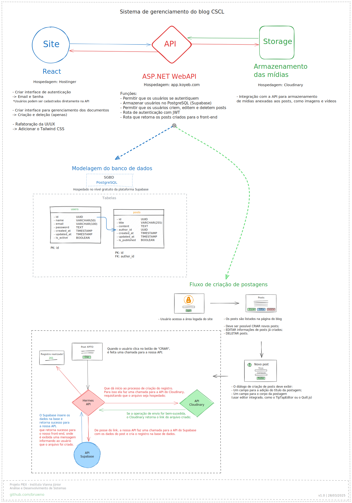

# HermesAPI

API que serve o sistema gerenciamento de postagens no blog, do site da Casa São Camilo de Lelis

## Sobre o projeto

Este é um projeto desenvolvido pelos alunos, do curso de Análise e Desenvolvimento de Sistemas, Mathews Baio, Renan Guedes, Samuel Costa e William Bruno para a disciplina de extensão PIEX, e é uma colaboração entre o Instituto Vianna Júnior e a Casa São Camilo de Lelis (de Juiz de Fora - MG).

### Objetivo

> A intenção desta API é permitir acesso e gerenciamento na área logada do site da Casa São Camilo de Lelis, na qual os usuários autorizados podem postar notícias e novidades, referentes ao dia a dia da instituição para acompanhamento pela comunidade.

### Configuração do Ambiente e Utilização

> Antes de poder utilizar as funcionalidade que a API serve, é necessário realizar alguns passos para tornar o serviço disponível.

**Variáveis de ambiente**

- Neste projeto estamos utlizando o pacote [DotNetEnv](https://www.nuget.org/packages/DotNetEnv), para lidar com as variáveis de ambiente. Logo, todas essas variáveis, que serão listadas abaixo, deverão estar em um arquivo **.env**, que deverá estar na raíz do projeto (Hermes/.env).

> Variáveis utilizadas no processo de geração de tokens JWT

`JWT_PRIVATE_KEY=`

`JWT_ISSUER=HermesAPI`

`JWT_AUDIENCE=`

> Variáveis utilizadas para o banco de dados

##### A implementação da camada Repository deste projeto utiliza o Micro-ORM Dapper e a versão do SQL é compatível com o PostgreSQL, por isso é recomendado hospedar o banco localmente ou em algum serviço que seja uma base de dados Postgres, como [Aiven](https://aiven.io/), [Supabase](https://supabase.com/), [Neon](https://neon.tech/home) ou outros.

`DATABASE_URL=`

> Variáveis utilizadas para o armazenamento de imagens

###### Na nossa implementação utilizamos o serviço de armazenamento de imagens do Cloudinary.

`CLOUDINARY_URL=`

`CLOUDINARY_UPLOAD_PRESET=`

**Docker**

- O arquivo Dockerfile presente no repositório já permite que serviços como o [Render](https://render.com/) ou a [Koyeb](https://www.koyeb.com/) façam o deploy da aplicação de forma automatizada. Para realizar o deploy em outras plataformas como o [GCP](https://console.cloud.google.com), [Azure](https://azure.microsoft.com/), [AWS](https://aws.amazon.com/) ou outras pode ser necessário realizar configurações mais específicas.

**Testes**

- O projeto ainda não conta com a implementação de testes automatizados, o que será feito futuramente.

---

## Esboço da arquitetura da API

- Este é apenas um planejamento, os serviços utilizados podem ser alterados no momento da implementação a depender das demandas.

## Documentação da API

> [Swagger | HermesAPI - Servidor de Homologação](https://hermesapi-homolog.onrender.com/swagger/index.html)

## Contato

- Para tratar deste projeto:

  [camilodelellisjf@gmail.com](camilodelellisjf@gmail.com)
