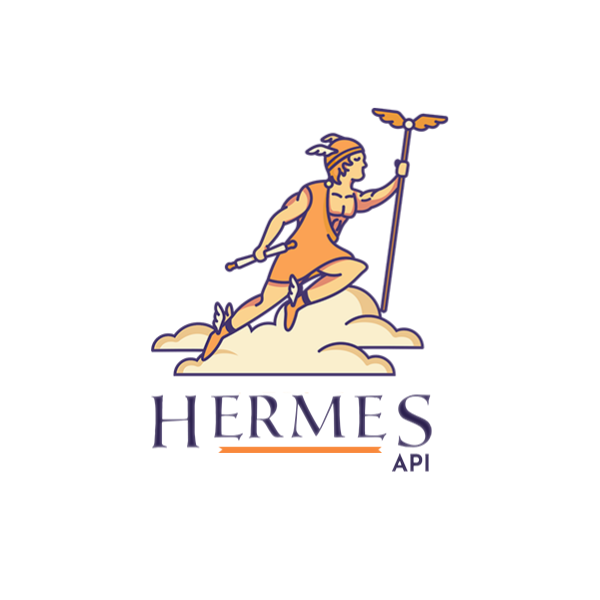
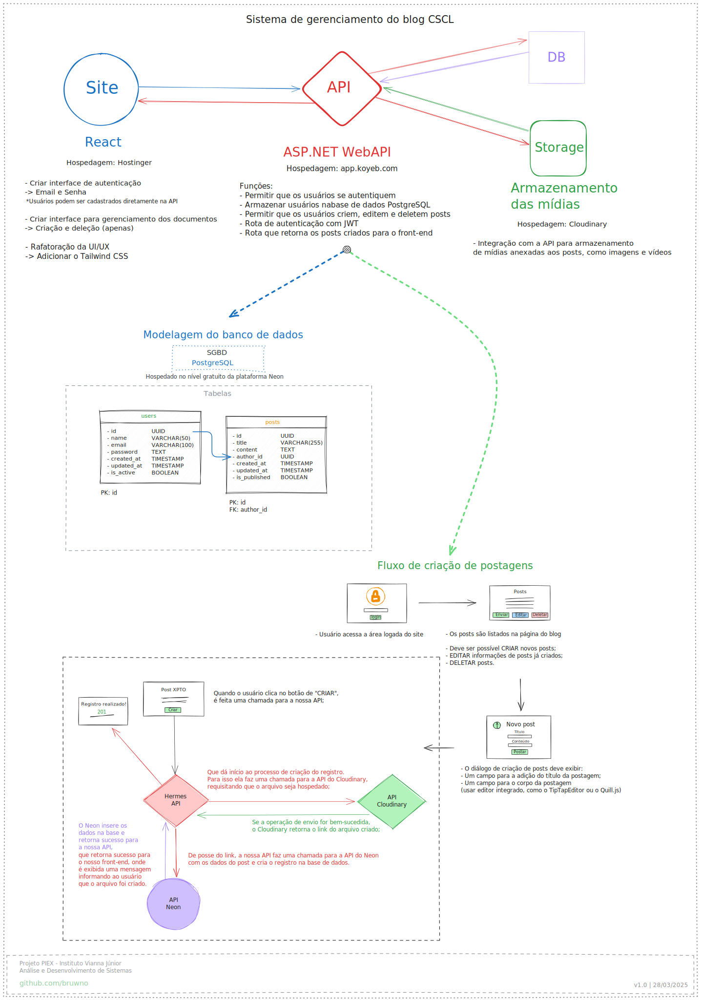

# HermesAPI

API que serve o sistema gerenciamento de postagens no blog, do site da Casa São Camilo de Lelis

## Sobre o projeto

Este é um projeto desenvolvido pelos alunos, do curso de Análise e Desenvolvimento de Sistemas, Mathews Baio, Renan Guedes, Samuel Costa e William Bruno para a disciplina de extensão PIEX, e é uma colaboração entre o Instituto Vianna Júnior e a Casa São Camilo de Lelis (de Juiz de Fora - MG).

### Objetivo

> A intenção desta API é permitir acesso e gerenciamento na área logada do site da Casa São Camilo de Lelis, na qual os usuários autorizados podem postar notícias e novidades, referentes ao dia a dia da instituição para acompanhamento pela comunidade.

## Esboço da arquitetura da API

- Este é apenas um planejamento, os serviços utilizados podem ser alterados no momento da implementação a depender das demandas.

## Documentação da API

> Em desenvolvimento.

## Contato

- Para tratar deste projeto:

  [camilodelellisjf@gmail.com](camilodelellisjf@gmail.com)